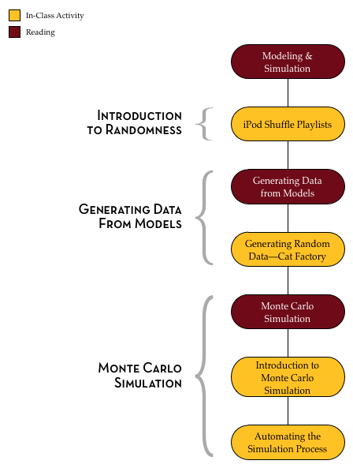

# Statistical Thinking: A Simulation Approach to Modeling Uncertainty {-}


```{r out.width="25%", echo=FALSE, fig.align='center'}
knitr::include_graphics("img/catalst-textbook-cover-v4.png")
```

<br />

This website is intended to serve as an organizational hub for the most current version of the CATALST Project's *Statistical Thinking: A Simulation Approach to Modeling Uncertainty*. Here you will be able to access materials such as readings, data sets, and the lab manual. It also includes helpful links and resources for each of the course topics.

<br />

### Licensing {-}

Copyright &copy; 2017 Catalysts for Change

PUBLISHED BY CATALYST PRESS

<a rel="license" href="http://creativecommons.org/licenses/by/4.0/"></a>

This work is licensed under a <a rel="license" href="http://creativecommons.org/licenses/by/4.0/">Creative Commons Attribution 4.0 International License</a>. You are free to share, remix, and to make commercial use of the work under the condition that you provide proper attribution. To reference this work, use:

- Zieffler, A., & Catalysts for Change. (2017). *Statistical Thinking: A simulation approach to uncertainty* (4th ed.). Minneapolis, MN: Catalyst Press. 

The work to create the material appearing in the book was made possible by the National Science Foundation (DUE–0814433). 

<br />

# Introduction {-}

Learning statistics is sexy. Hal Varian, Google's chief economist, believes this. During an [interview in McKinsey Quarterly](http://www.mckinseyquarterly.com/Hal_Varian_on_how_the_Web_challenges_managers_2286), Varian stated, "I keep saying the sexy job in the next ten years will be statisticians. People think I'm joking, but who would've guessed that computer engineers would've been the sexy job of the 1990s?" Varian is not the only person to express this sentiment either. Hans Rosling in the 2010 BBC documentary Joy of Stats^[Watch *Joy of Stats* online at [http://www.gapminder.org/videos/the-joy-of-stats/](http://www.gapminder.org/videos/the-joy-of-stats/)] referred to statistics as the "sexiest subject around".

Whether you believe it is the sexiest subject or not, it is incontrovertible that the use of statistics and data are prevalent in today's information age. Almost every person on earth will benefit from learning some foundational ideas of statistics. This is true because statistics forms the basis of our everyday world just as much as do science, technology, and politics. Google, Netflix, Twitter, Facebook, OKCupid, Match.com, Amazon, iTunes, and the Federal Government are just a handful of the companies and organizations that use statistics on a daily basis. Journalism, political science, biology, sociology, psychology, graphic design, economics, sports science, and dance are all disciplines that have made use of statistical methodology.

### Course Material {-}

The materials on this website and in the Lab Manual will introduce you to the seminal ideas underlying the discipline of statistics. In addition, they have been designed with your learning in mind. For example, many of the class activities were developed using pedagogical principles, such as small group activities and discussion, that have been shown in research to improve student learning. 

Course readings should be completed outside of class and are intended to help you learn and extend the ideas, skills, and concepts you learn in the classroom. The readings themselves are not all "traditional" readings in the sense of words written on the screen, but instead often link to video clips, blogs and other multimedia material. 

The Lab Manual can be obtained [here](https://github.com/zief0002/Statistical-Thinking/blob/master/Statistical-Thinking-v3.pdf?raw=true). You will need to bring a copy of the lab manual (physical or electronic) with you to class every day. 


### TinkerPlots&trade; Software {-}

Much of the material presented in the [Lab Manual](https://github.com/zief0002/Statistical-Thinking/blob/master/Statistical-Thinking-v3.pdf?raw=true) requires the use of TinkerPlots&trade;. This software can be downloaded (for Mac or PC), and a license can be purchased from [http://www.tinkerplots.com/](http://www.tinkerplots.com/).


### Data Sets {-}

The data sets used in the [Lab Manual](https://github.com/zief0002/Statistical-Thinking/blob/master/Statistical-Thinking-v3.pdf?raw=true), as well as those used in EPsy 3264 assignments, are available at [https://github.com/zief0002/Statistical-Thinking/archive/master.zip](https://github.com/zief0002/Statistical-Thinking/archive/master.zip). Clicking this link will download a ZIP file to your computer. This file includes all the data sets and the Lab Manual. Double-click on the ZIP file to view all the materials.

### Participation in the Learning Process {-}

The [Lab Manual](https://github.com/zief0002/Statistical-Thinking/blob/master/Statistical-Thinking-v3.pdf?raw=true), instructors, and teaching assistants are all resources that are at your disposal to help you learn the material. In the end, however, you will have to do all of the hard work associated with actually learning that material. To successfully navigate this process, it is vital that you be an active participant in the learning process. Coming to class, participating in the activities and discussions, reading, completing the assignments, and asking questions are essential to successful learning.

Learning anything new takes time and effort and this is especially true of learning statistics, as you are not just learning a set of methods, but rather a disciplined way of thinking about the world. Changing your habits of mind will take continual practice. It will also take a great deal of patience and persistence. 

As you engage in and use the skills, concepts and ideas introduced in the material, you will find yourself thinking about data and evidence in a different way. This may lead you to make different decisions or choices. But, even if this course does not change your world overnight, you will at the very least be able to critically think about inferences and conclusions drawn from data.


# Modeling &amp; Simulation {-}

> There is mounting evidence that the "model-building era"" that dominated the theoretical activities of the sciences for a long time is about to be succeeded or at least lastingly supplemented by the "simulation era".^[Hartmann, S. (2005). *The world as a process: Simulations in the natural and social sciences.* [http://philsci-archive.pitt.edu/2412/](http://philsci-archive.pitt.edu/2412/)]


Modeling is one of the most important subjects you may ever learn. It is used in microbiology, macroeconomics, urban studies, sociology, psychology, public health, computer science, and of course, statistics. In fact, modeling is a method that is used in almost every discipline. Many think that it is an important skill to learn because it is so pervasive. While this is true, even more important is how closely the skills of modeling tie to the more general skills of problem solving. Starfield, Smith, and Bleloch (1994) summed this sentiment up nicely when they wrote, "learning to model is bound up with learning to solve problems and to think imaginatively and purposefully" (p. x).^[Starfield, A. M., Smith, K. A., &amp; Bleloch, A. L. (1994). *How to model it: Problem solving for the computer age.* Edina, MN: Burgess International Group, Inc.]

A model is a simplified representation of a system that can be used to promote an understanding of a more complex system. For example, meteorologists use computers to build models of the climate to understand and predict the weather. The computer model includes behaviors or properties which correspond, in some way, to the particular real-world system of climate. The computer models, however, do not include every possible detail about climate. All models leave things out and get some things&mdash;many things&mdash;wrong. This is because all models are simplifications of reality. Since all models are simplifications of reality there is always a trade-off as to what level of detail is included in the model. If too little detail is included in the model one runs the risk of missing relevant interactions and the resultant model does not promote understanding. If too much detail is included in the model, the model may become overly complicated and actually preclude the development of understanding.

Models have many purposes, but are primarily used to better understand phenomena in the real-world. Common uses of models are for description, exploration, prediction, and classification. For example, Google builds models to understand and predict peoples' internet searching tendencies. These models are then used to help Google carry out more efficient and better searches of information. As another example, Netflix builds models to understand the characteristics of movies that their customers have rated highly so that they can then recommend other movies that the person may enjoy. Amazon and Apple iTunes both use models in similar manners.

### Outline and Goals of Unit 1 {-}

The following schematic outlines the course readings, in-class activities, and assignments for Unit 1.

<br />

```{r out.width="50%", echo=FALSE, fig.align='left'}

```

<br />

In this unit, you will begin by exploring ideas of randomness. Randomness permeates, and is, in fact, fundamental to statistics. Then, you will learn how to use TinkerPlots&trade; to model several random processes and generate outcomes from those models. By generating data from different models, you will gain experience in considering the variation in outcomes that is produced by these random processes. This consideration will help you understand and overcome many misleading human intuitions about randomness.

You will also be introduced to the Monte Carlo simulation process and learn how to carry out a Monte Carlo simulation using TinkerPlots&trade;. This process allows you to quickly generate multiple data sets from a model in order to carry out hypothetical experiments. For example, we could ask the question: How likely is it to rain three out of the five days on my vacation given a particular forecast? By modeling the forecast and repeatedly generating data for the five days of vacation, we can then answer this question. 

As you progress through the unit, remember that the modeling process is a creative process that can often be very challenging. At times, this might lead to frustration as you are learning and practicing some of the material. But, as Mosteller et al. (1973) remind us, it is also a profitable experience since, "modeling is not only a technique of statistics&hellip;it is a method of study which can be applied in many other fields as well" (p. xii).^[Mosteller, F., Kruskal, W. H., Link, R. F., Pieters, R. S., &amp; Rising, G. R. (1973). *Statistics by example: Finding models.* Reading, MA: Addison–Wesley.] 


# Randomness {-}

To begin your statistical journey, we will have you watch the following YouTube video: 

- [Random Sequences: Human vs. Coin](https://www.youtube.com/v/H2lJLXS3AYM)


# Generating Data from Models {-}

One core skill of a practicing statistician is to be able to generate random data from a model. Most of the models you will encounter in this course are referred to as *probability models*. That is just a fancy way of associating probabilities with different events, or outcomes, in a model. 

For example, the model of flipping a "fair" coin is a probability model. There are two events/outcomes in the model: heads and tails. Each of these outcomes has a probability of 0.5 associaited with it. (Note that although we could say 50%, that probabilities are on the scale from 0 to 1, so are defined using decimal values.) 

In the in-class activity, *Generating Random Data&mdash;Cat Factory*, you will create several probability models to generate data about cats. To prepare for this activity, watch the following TinkerPlots&trade; tutorial video: 

- [Probability Simulation](http://www.tinkerplots.com/movies/probability-simulation)


# Monte Carlo Simulation {-}

Monte Carlo simulation is one method that statisticians use to understand real-world phenomena. In Monte Carlo simulation, a model is used to generate multiple (sometimes millions) of data sets. By examining the data sets produced (or summaries of the data sets produced), researchers can draw insight about and predict what might happen in the real-world under a given set of circumstances. You can read about the fascinating origins of Monte Carlo simulation in the following article: 

- [The Beginning of the Monte Carlo Method](http://www.webpages.uidaho.edu/~stevel/565/literature/The%20Beginning%20of%20Monte%20Carlo%20Method.pdf)


### Example of a Simulation Study {-}

In 1978, China introduced the "one-child" policy in order to alleviate social, economic, and environmental problems in China. According to Wikipedia,^[One-child policy. (2015, May 30). In Wikipedia, The Free Encyclopedia. Retrieved 18:02, June 1, 2015, from [http://en.wikipedia.org/w/index.php?title=One-child_policy&oldid=664745432](http://en.wikipedia.org/w/index.php?title=One-child_policy&oldid=664745432)]

> The policy officially restricts the number of children married urban couples can have to one, although it allows exemptions for several cases, including rural couples, ethnic minorities, and parents without any siblings themselves. A spokesperson of the Committee on the One-Child Policy has said that approximately 35.9% of China's population is currently subject to the one-child restriction.

Although the Chinese government has suggested that the policy has prevented more than 250 million births from its implementation to 2000, the policy is controversial both within and outside of China because of the manner in which the policy has been implemented. There have also been concerns raised about potential negative economic and social consequences, in part because many families were determined to have a son. Scholars have wondered how things would change if instead of a one-child policy, a country adopted a "one son" policy. A "one son" policy would allow families to keep having children until they had a son. If a family's first child is a boy, they would be restricted from having more children. If, however, the first child was a daughter, the family could continue having children until a son was born. For example, they might ask the question,


<div class="image">
  
  <span class="oval-thought"><center>If China adopted a "one son" policy, how <br /> would the policy affect the average number of <br /> children per family, which is currently 1.6^[[World Factbook](https://www.cia.gov/library/publications/the-world-factbook/fields/2127.html)]?</center></span>
</div>


One way in which this question could be studied (without actually implementing the policy) would be to conduct a simulation study by modeling this situation and generating many data sets from the model. Consider for a minute how you might model the number of children a particular family would have. 

One way to model this is to write the word **boy** on one index card and the word **girl** on another index card and to place those two index cards in a hat. After mixing up the index cards, you could draw a single card from the hat. If the card has the word boy written on it, the simulated "family" would be reported to have one child. If the card has the word girl written on it, a tally mark could be recorded and the index card would be replaced in the hat. The cards could then be remixed and another card would be drawn. If the card drawn has the word **boy** written on it, the simulated "family" would be reported to have two children. If the card has the word **girl** written on it, another tally mark could be recorded and the index card would again be replaced in the hat. This process would continue until the **boy** card was drawn. The table below shows the results after carrying out this process for three simulated families.

<br />

```{r echo=FALSE}
d = data.frame(
  Family = c("Family #1", "Family #2", "Family #3"),
  Girl   = c("&#10004;", "", "&#10004;&#10004;"),
  Boy    = c("&#10004;", "&#10004;", "&#10004;")
)

knitr::kable(
  d, booktabs = TRUE,
  caption = 'The recorded number of girls and boys for three simulated families.'
)
```

<br />

We could carry out this simulation for many families, say 500 families, and use the results to provide an answer to the research question. You can imagine that carrying out even this simple simulation would quickly become quite tedious. Simulation studies, such as this, are typically carried out using computer programs. In this unit, you will learn to use a computer program called TinkerPlots&trade; to model processes in the real-world and carry out simulation studies. 

### Simulation Assumptions {-}

"Wait," you say. "Even if I carried out this simulation, I still would not be able to provide an answer to the research question! It doesn't reflect reality! Some families may not want to have any children, while others might be happy to stop after a girl was born. What about multiple births?""

Maybe you are even questioning whether the probability of having a boy or having a girl is really 50:50. These are all valid points, and all would likely affect the results of the simulation, which in turn affects the inferences and conclusions that are drawn.

While the model used in the "one son" example is overly simplistic for drawing any sorts of meaningful conclusions about implementing such a policy in China, it could however, provide a useful starting point for introducing additional complexity. Even in the most enormously complicated modeling problem, researchers often make many simplifying assumptions. (Remember that all models—even those that seem quite complex—are simplifications of reality and get many things wrong.) With enough simplification, a model can be constructed and studied. The model is evaluated and often revised or updated as certain assumptions are deemed tenable and others are not. Because of this process, simulation studies are generally iterative in their development. This iteration process continues until an adequate level of understanding is developed and the research question can be answered.

### Simulation in Practice {-}

In practice, statisticians often use incredibly complex models to generate their data. As an example, Electronic Arts, the video game company behind titles such as *Madden*, *NHL* and *FIFA*, uses game telemetry (the transmission of data from a game executable for recording and analysis) to model the gameplay patterns of players and identify the elements of their games that are highly correlated with player retention.^[Weber, B. G., John, M., Mateas, M., &amp; Jhala, A. (2011). *Modeling player retention in Madden NFL 11.*  Presented at Innovative Applications of Artificial Intelligence. [http://users.soe.ucsc.edu/~bweber/pubs/madden11retention.pdf](http://users.soe.ucsc.edu/~bweber/pubs/madden11retention.pdf)] By understanding the behavior of players and the common patterns that are used, Electronic Arts game developers can focus their attention on more relevant features in future iterations of the game and ultimately reduce production costs. 

For example, in their examination of *Madden NFL 11*, Electronic Arts used 46 features to model players' preferences, including their control usage, performance, and play-calling style. This is but one example of using simulation in video games. To see other applications of how data are being used in video game design, watch the webinar, [How Big Data and Statistical Modeling are Changing Video Games](http://blog.revolutionanalytics.com/2013/06/how-big-data-and-statistical-modeling-are-changing-video-games.html).


