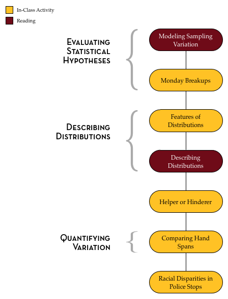
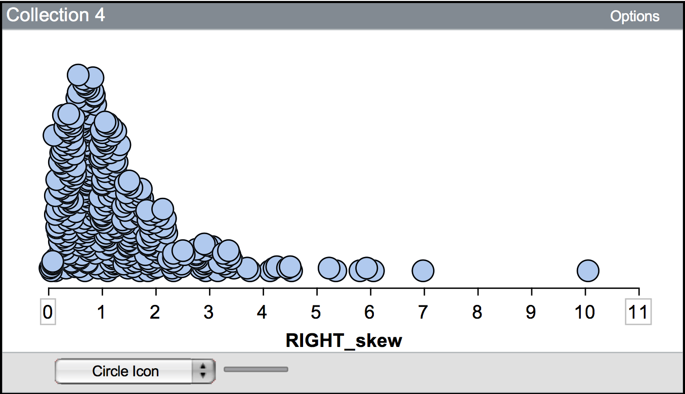
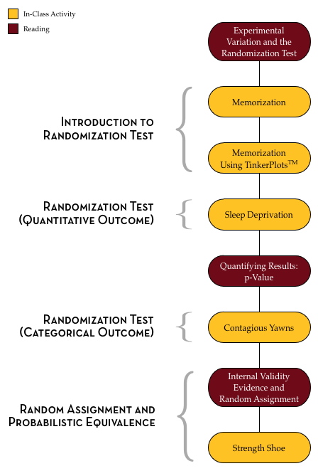

# Statistical Thinking: A Simulation Approach to Modeling Uncertainty {-}


```{r out.width="25%", echo=FALSE, fig.align='center'}

```

<br />

This website is intended to serve as an organizational hub for the most current version of the CATALST Project's *Statistical Thinking: A Simulation Approach to Modeling Uncertainty*. Here you will be able to access materials such as readings, data sets, and the lab manual. It also includes helpful links and resources for each of the course topics.

<br />

### Licensing {-}

Copyright &copy; 2017 Catalysts for Change

PUBLISHED BY CATALYST PRESS

<a rel="license" href="http://creativecommons.org/licenses/by/4.0/"></a>

This work is licensed under a <a rel="license" href="http://creativecommons.org/licenses/by/4.0/">Creative Commons Attribution 4.0 International License</a>. You are free to share, remix, and to make commercial use of the work under the condition that you provide proper attribution. To reference this work, use:

- Zieffler, A., & Catalysts for Change. (2017). *Statistical Thinking: A simulation approach to uncertainty* (4th ed.). Minneapolis, MN: Catalyst Press. [http://zief0002.github.io/statistical-thinking/](http://zief0002.github.io/statistical-thinking/)

The work to create the material appearing in the book was made possible by the National Science Foundation (DUE–0814433). 

<br />

# Introduction {-}

Learning statistics is sexy. Hal Varian, Google's chief economist, believes this. During an [interview in McKinsey Quarterly](http://www.mckinseyquarterly.com/Hal_Varian_on_how_the_Web_challenges_managers_2286), Varian stated, "I keep saying the sexy job in the next ten years will be statisticians. People think I'm joking, but who would've guessed that computer engineers would've been the sexy job of the 1990s?" Varian is not the only person to express this sentiment either. Hans Rosling in the 2010 BBC documentary Joy of Stats^[Watch *Joy of Stats* online at [http://www.gapminder.org/videos/the-joy-of-stats/](http://www.gapminder.org/videos/the-joy-of-stats/)] referred to statistics as the "sexiest subject around".

Whether you believe it is the sexiest subject or not, it is incontrovertible that the use of statistics and data are prevalent in today's information age. Almost every person on earth will benefit from learning some foundational ideas of statistics. This is true because statistics forms the basis of our everyday world just as much as do science, technology, and politics. Google, Netflix, Twitter, Facebook, OKCupid, Match.com, Amazon, iTunes, and the Federal Government are just a handful of the companies and organizations that use statistics on a daily basis. Journalism, political science, biology, sociology, psychology, graphic design, economics, sports science, and dance are all disciplines that have made use of statistical methodology.

### Course Material {-}

The materials on this website and in the lab manual will introduce you to the seminal ideas underlying the discipline of statistics. In addition, they have been designed with your learning in mind. For example, many of the class activities were developed using pedagogical principles, such as small group activities and discussion, that have been shown in research to improve student learning. 

Course readings should be completed outside of class and are intended to help you learn and extend the ideas, skills, and concepts you learn in the classroom. The readings themselves are not all "traditional" readings in the sense of words written on the screen, but instead often link to video clips, blogs and other multimedia material. 

The [lab manual can be obtained here](https://github.com/zief0002/Statistical-Thinking/blob/master/Statistical-Thinking-v3.pdf?raw=true). You will need to bring a copy of the lab manual (physical or electronic) with you to class every day. 


### TinkerPlots&trade; Software {-}

Much of the material presented in the lab manual requires the use of TinkerPlots&trade;. This software can be downloaded (for Mac or PC), and a license can be purchased from [http://www.tinkerplots.com/](http://www.tinkerplots.com/).


### Data Sets {-}

The data sets used in the [Lab Manual](https://github.com/zief0002/Statistical-Thinking/blob/master/Statistical-Thinking-v3.pdf?raw=true), as well as those used in EPsy 3264 assignments, are available at [https://github.com/zief0002/Statistical-Thinking/archive/master.zip](https://github.com/zief0002/Statistical-Thinking/archive/master.zip). Clicking this link will download a ZIP file to your computer. This file includes all the data sets and the Lab Manual. Double-click on the ZIP file to view all the materials.

### Participation in the Learning Process {-}

The lab manual, instructors, and teaching assistants are all resources that are at your disposal to help you learn the material. In the end, however, you will have to do all of the hard work associated with actually learning that material. To successfully navigate this process, it is vital that you be an active participant in the learning process. Coming to class, participating in the activities and discussions, reading, completing the assignments, and asking questions are essential to successful learning.

Learning anything new takes time and effort and this is especially true of learning statistics, as you are not just learning a set of methods, but rather a disciplined way of thinking about the world. Changing your habits of mind will take continual practice. It will also take a great deal of patience and persistence. 

As you engage in and use the skills, concepts and ideas introduced in the material, you will find yourself thinking about data and evidence in a different way. This may lead you to make different decisions or choices. But, even if this course does not change your world overnight, you will at the very least be able to critically think about inferences and conclusions drawn from data.


# Unit 1: Modeling &amp; Simulation {-}

> There is mounting evidence that the "model-building era"" that dominated the theoretical activities of the sciences for a long time is about to be succeeded or at least lastingly supplemented by the "simulation era".^[Hartmann, S. (2005). *The world as a process: Simulations in the natural and social sciences.* [http://philsci-archive.pitt.edu/2412/](http://philsci-archive.pitt.edu/2412/)]


Modeling is one of the most important subjects you may ever learn. It is used in microbiology, macroeconomics, urban studies, sociology, psychology, public health, computer science, and of course, statistics. In fact, modeling is a method that is used in almost every discipline. Many think that it is an important skill to learn because it is so pervasive. While this is true, even more important is how closely the skills of modeling tie to the more general skills of problem solving. Starfield, Smith, and Bleloch (1994) summed this sentiment up nicely when they wrote, "learning to model is bound up with learning to solve problems and to think imaginatively and purposefully" (p. x).^[Starfield, A. M., Smith, K. A., &amp; Bleloch, A. L. (1994). *How to model it: Problem solving for the computer age.* Edina, MN: Burgess International Group, Inc.]

A model is a simplified representation of a system that can be used to promote an understanding of a more complex system. For example, meteorologists use computers to build models of the climate to understand and predict the weather. The computer model includes behaviors or properties which correspond, in some way, to the particular real-world system of climate. The computer models, however, do not include every possible detail about climate. All models leave things out and get some things&mdash;many things&mdash;wrong. This is because all models are simplifications of reality. Since all models are simplifications of reality there is always a trade-off as to what level of detail is included in the model. If too little detail is included in the model one runs the risk of missing relevant interactions and the resultant model does not promote understanding. If too much detail is included in the model, the model may become overly complicated and actually preclude the development of understanding.

Models have many purposes, but are primarily used to better understand phenomena in the real-world. Common uses of models are for description, exploration, prediction, and classification. For example, Google builds models to understand and predict peoples' internet searching tendencies. These models are then used to help Google carry out more efficient and better searches of information. As another example, Netflix builds models to understand the characteristics of movies that their customers have rated highly so that they can then recommend other movies that the person may enjoy. Amazon and Apple iTunes both use models in similar manners.

### Outline and Goals of Unit 1 {-}

The following schematic outlines the course readings, in-class activities, and assignments for Unit 1.

<br />

```{r out.width="50%", echo=FALSE, fig.align='left'}
knitr::include_graphics("img/unit-01-outline.png")
```

<br />

In this unit, you will begin by exploring ideas of randomness. Randomness permeates, and is, in fact, fundamental to statistics. Then, you will learn how to use TinkerPlots&trade; to model several random processes and generate outcomes from those models. By generating data from different models, you will gain experience in considering the variation in outcomes that is produced by these random processes. This consideration will help you understand and overcome many misleading human intuitions about randomness.

You will also be introduced to the Monte Carlo simulation process and learn how to carry out a Monte Carlo simulation using TinkerPlots&trade;. This process allows you to quickly generate multiple data sets from a model in order to carry out hypothetical experiments. For example, we could ask the question: How likely is it to rain three out of the five days on my vacation given a particular forecast? By modeling the forecast and repeatedly generating data for the five days of vacation, we can then answer this question. 

As you progress through the unit, remember that the modeling process is a creative process that can often be very challenging. At times, this might lead to frustration as you are learning and practicing some of the material. But, as Mosteller et al. (1973) remind us, it is also a profitable experience since, "modeling is not only a technique of statistics&hellip;it is a method of study which can be applied in many other fields as well" (p. xii).^[Mosteller, F., Kruskal, W. H., Link, R. F., Pieters, R. S., &amp; Rising, G. R. (1973). *Statistics by example: Finding models.* Reading, MA: Addison–Wesley.] 


# Randomness {-}

To begin your statistical journey, we will have you watch the following YouTube video: 

- [Random Sequences: Human vs. Coin](https://www.youtube.com/v/H2lJLXS3AYM)


# Generating Data from Models {-}

One core skill of a practicing statistician is to be able to generate random data from a model. Most of the models you will encounter in this course are referred to as *probability models*. That is just a fancy way of associating probabilities with different events, or outcomes, in a model. 

For example, the model of flipping a "fair" coin is a probability model. There are two events/outcomes in the model: heads and tails. Each of these outcomes has a probability of 0.5 associaited with it. (Note that although we could say 50%, that probabilities are on the scale from 0 to 1, so are defined using decimal values.) 

In the in-class activity, *Generating Random Data&mdash;Cat Factory*, you will create several probability models to generate data about cats. To prepare for this activity, watch the following TinkerPlots&trade; tutorial video: 

- [Probability Simulation](http://www.tinkerplots.com/movies/probability-simulation)


# Monte Carlo Simulation {-}

Monte Carlo simulation is one method that statisticians use to understand real-world phenomena. In Monte Carlo simulation, a model is used to generate multiple (sometimes millions) of data sets. By examining the data sets produced (or summaries of the data sets produced), researchers can draw insight about and predict what might happen in the real-world under a given set of circumstances. You can read about the fascinating origins of Monte Carlo simulation in the following article: 

- [The Beginning of the Monte Carlo Method](http://www.webpages.uidaho.edu/~stevel/565/literature/The%20Beginning%20of%20Monte%20Carlo%20Method.pdf)


### Example of a Simulation Study {-}

In 1978, China introduced the "one-child" policy in order to alleviate social, economic, and environmental problems in China. According to Wikipedia,^[One-child policy. (2015, May 30). In Wikipedia, The Free Encyclopedia. Retrieved 18:02, June 1, 2015, from [http://en.wikipedia.org/w/index.php?title=One-child_policy&oldid=664745432](http://en.wikipedia.org/w/index.php?title=One-child_policy&oldid=664745432)]

> The policy officially restricts the number of children married urban couples can have to one, although it allows exemptions for several cases, including rural couples, ethnic minorities, and parents without any siblings themselves. A spokesperson of the Committee on the One-Child Policy has said that approximately 35.9% of China's population is currently subject to the one-child restriction.

Although the Chinese government has suggested that the policy has prevented more than 250 million births from its implementation to 2000, the policy is controversial both within and outside of China because of the manner in which the policy has been implemented. There have also been concerns raised about potential negative economic and social consequences, in part because many families were determined to have a son. Scholars have wondered how things would change if instead of a one-child policy, a country adopted a "one son" policy. A "one son" policy would allow families to keep having children until they had a son. If a family's first child is a boy, they would be restricted from having more children. If, however, the first child was a daughter, the family could continue having children until a son was born. For example, they might ask the question,


<div class="image">
  
  <span class="oval-thought"><center>If China adopted a "one son" policy, how <br /> would the policy affect the average number of <br /> children per family, which is currently 1.6^[[World Factbook](https://www.cia.gov/library/publications/the-world-factbook/fields/2127.html)]?</center></span>
</div>


One way in which this question could be studied (without actually implementing the policy) would be to conduct a simulation study by modeling this situation and generating many data sets from the model. Consider for a minute how you might model the number of children a particular family would have. 

One way to model this is to write the word **boy** on one index card and the word **girl** on another index card and to place those two index cards in a hat. After mixing up the index cards, you could draw a single card from the hat. If the card has the word boy written on it, the simulated "family" would be reported to have one child. If the card has the word girl written on it, a tally mark could be recorded and the index card would be replaced in the hat. The cards could then be remixed and another card would be drawn. If the card drawn has the word **boy** written on it, the simulated "family" would be reported to have two children. If the card has the word **girl** written on it, another tally mark could be recorded and the index card would again be replaced in the hat. This process would continue until the **boy** card was drawn. The table below shows the results after carrying out this process for three simulated families.

<br />

```{r echo=FALSE}
d = data.frame(
  Family = c("Family #1", "Family #2", "Family #3"),
  Girl   = c("&#10004;", "", "&#10004;&#10004;"),
  Boy    = c("&#10004;", "&#10004;", "&#10004;")
)

knitr::kable(
  d, booktabs = TRUE,
  caption = 'The recorded number of girls and boys for three simulated families.'
)
```

<br />

We could carry out this simulation for many families, say 500 families, and use the results to provide an answer to the research question. You can imagine that carrying out even this simple simulation would quickly become quite tedious. Simulation studies, such as this, are typically carried out using computer programs. In this unit, you will learn to use a computer program called TinkerPlots&trade; to model processes in the real-world and carry out simulation studies. 

### Simulation Assumptions {-}

"Wait," you say. "Even if I carried out this simulation, I still would not be able to provide an answer to the research question! It doesn't reflect reality! Some families may not want to have any children, while others might be happy to stop after a girl was born. What about multiple births?""

Maybe you are even questioning whether the probability of having a boy or having a girl is really 50:50. These are all valid points, and all would likely affect the results of the simulation, which in turn affects the inferences and conclusions that are drawn.

While the model used in the "one son" example is overly simplistic for drawing any sorts of meaningful conclusions about implementing such a policy in China, it could however, provide a useful starting point for introducing additional complexity. Even in the most enormously complicated modeling problem, researchers often make many simplifying assumptions. (Remember that all models—even those that seem quite complex—are simplifications of reality and get many things wrong.) With enough simplification, a model can be constructed and studied. The model is evaluated and often revised or updated as certain assumptions are deemed tenable and others are not. Because of this process, simulation studies are generally iterative in their development. This iteration process continues until an adequate level of understanding is developed and the research question can be answered.

### Simulation in Practice {-}

In practice, statisticians often use incredibly complex models to generate their data. As an example, Electronic Arts, the video game company behind titles such as *Madden*, *NHL* and *FIFA*, uses game telemetry (the transmission of data from a game executable for recording and analysis) to model the gameplay patterns of players and identify the elements of their games that are highly correlated with player retention.^[Weber, B. G., John, M., Mateas, M., &amp; Jhala, A. (2011). *Modeling player retention in Madden NFL 11.*  Presented at Innovative Applications of Artificial Intelligence. [http://users.soe.ucsc.edu/~bweber/pubs/madden11retention.pdf](http://users.soe.ucsc.edu/~bweber/pubs/madden11retention.pdf)] By understanding the behavior of players and the common patterns that are used, Electronic Arts game developers can focus their attention on more relevant features in future iterations of the game and ultimately reduce production costs. 

For example, in their examination of *Madden NFL 11*, Electronic Arts used 46 features to model players' preferences, including their control usage, performance, and play-calling style. This is but one example of using simulation in video games. To see other applications of how data are being used in video game design, watch the webinar, [How Big Data and Statistical Modeling are Changing Video Games](http://blog.revolutionanalytics.com/2013/06/how-big-data-and-statistical-modeling-are-changing-video-games.html).


# Unit 2: Hypothesis Evaluation {-}

In the course activities and homework assignments, you have been using probability models to generate random outcomes. You have also learned how to use Monte Carlo simulation to generate many data sets from a given model. This is the same kind of process that researchers, scientists, and statisticians engage in when they evaluate (or test) hypotheses about the world. 


To illustrate the ideas behind statistical hypothesis testing, consider how you might go about testing a coin for "fairness". You might have suggested something along the lines of "flip the coin many times and keep track of the number of heads and tails". Suppose you tossed the coin 100 times, which resulted in 53 heads and 47 tails. Would you say the coin is "unfair"? What if you had obtained 65 heads and 35 tails instead? Now would you say the coin is "unfair"? How about if you had gotten 84 heads and only 16 tails?

The first result of 53 heads and 47 tails probably did not seem that far fetched to you, and you probably would feel at ease saying that the coin that produced such a result is most likely "fair". On the other hand, the results of 65 heads and 35 tails&mdash;and especially 84 heads and 16 tails&mdash;likely made you feel uncomfortable about declaring the coin "fair". 

Why is this? It is because you had a mental model of the distribution of heads and tails that you expect when the coin actually IS "fair". For most people, this mental model encompasses a [uniform distribution of the outcomes](http://en.wikipedia.org/wiki/Uniform_distribution_(discrete)) (e.g., a 50:50 split between heads and tails). If the observed result of the 100 coin flips is consistent with the model of a "fair" coin, you might conclude that the coin is "fair". For example, the result of 53 heads from 100 flips is very close to the 50:50 split of heads and tails, and  it is probably safe to say that a “fair” coin could have produced the set of flips in question. In this case, the data are consistent with the model of "fairness".

If the observed result deviates from what is expected under the model of a "fair" coin, for example the two results of 65 heads and 84 heads, you might end up rejecting the hypothesis that the coin was "fair". In these two cases, the data are inconsistent with the model of "fairness".

One thing you may have realized is that we expect variation in the results just because of chance (randomness). For example, if you flipped 100 coins over and over (say, 500 times), you would not get 50 heads every time. Knowing the amount of variation that is expected is how we can judge whether data are consistent or inconsistent with the model. Luckily, we can model the expected variation using Monte Carlo simulation.

### Simulation Process for Evaluating Hypotheses {-}

The process we will use for evaluating a hypothesis is:

(1) Create a model that conforms to the hypothesis to be evaluated.
(2) Use the selected model to generate many, many sets of data (Monte Carlo simulation). The results you collect and pool together from these trials will give a picture of the variation you would expect under the hypothesized model.
(3) Evaluate whether the results observed in the actual data (not the simulated data) are consistent with the expected results produced from the model. This acts as evidence to either support or dispute the hypotheis. 

To help you remember this process, you can use the more simplistic:

- Model
- Simulate
- Evaluate

This may sound like a straight-forward process, but in practice it can actually be quite complex&mdash;especially as you are reading research articles and trying to interpret the findings. First off, the model that is selected is often not provided, nor described, explicitly within most research articles. It is often left to the reader to figure out what the assumed model was. At first, this may be quite difficult, but like most tasks, as you gain experience in this course and as you read more research, you find that there are a common set of models that are typically used by researchers.

The model that you use in the Monte Carlo simulation is directly related to the hypothesis you make about a research question. Often researchers explicitly state hypotheses about their research questions. Hypotheses are simply statements of possible explanations for an observed set of data. For example, one possible explanation for the observed set of coin flips is:

> The coin used to generate the set of observed coin flips is a "fair" coin; which would produce (in the long run) a uniform distribution of heads and tails. 

One complication that you may encounter is that many statisticians and researchers write their hypotheses mathematically. The advantage to writing a hypothesis mathematically is that it explicitly defines the model that will be used in the Monte Carlo simulation. Consider the stated hypothesis that the coin used to generate the set of observed coin flips is a "fair" coin that produces a uniform distribution of heads and tails. Recall that producing a uniform distribution of heads and tails means that heads and tails are equally likely under this model (i.e., a 50:50 split). We could express this hypothesis more mathematically as: 

> The model produces heads (and tails) with a probability of 0.5. 

Symbolically, we would express this hypothesis as:

$$
H_0: \pi_{\mathrm{Heads,~Tails}} = 0.5
$$

The symbol $H_0$ is common and indicates a hypothesis about a model. Here, $\pi$ is the greek letter pi and means "probability" or "proportion". (Typically in symbolic notation for hypotheses, pi is not the mathematical constant of 3.14.) Statisticians typically use Greek letters to identify probabilities of the outcomes in a model.^[**Greek vs. Roman Letters** <br /> Greek letters are used when the parameters of a model are being described. In contrast, Roman letters are used to describe observed results. For example, go back to the situation in which the observed data consisted of 53 heads and 47 tails from 100 flips of a coin. <br /><br /> Here we would say $p_{\mathrm{Heads}} = 0.53$. The hypothesis about the model we are evaluating produces heads with a probability of 0.5, so $\pi_{\mathrm{Heads,~Tails}} = 0.5$. <br /><br /> Rather than use the Roman letters, some statisticians prefer to put a "hat" on the Greek letter to refer to the observed result. For example, $\hat{\pi}_{\mathrm{Heads}}=0.53$. <br /><br /> In this course we are not as concerned about which notation you use to express the result observed in the actual data. In fact, it might be less confusing if you just write, *the observed result is 0.53*.] In this hypothesis, we are establishing that the model we are evaluating generates heads (and tails) with a probability of 0.5. 

Notice how the model is completely defined using the mathematical notation. The hypothesis states that the model has two potential outcomes (heads and tails), and the probability of each is 0.5. Pretty cool, huh? Although the more qualitative hypothesis that the coin used to generate the set of observed coin flips is a "fair" coin that produces a uniform distribution of heads and tails may seem more understandable (at least right now), 


If this all seems like gibberish to you right now, do not worry about it. You can always write hypotheses descriptively, without resorting to the symbolic notation. Remember, we wrote the EXACT SAME hypothesis three different ways. If you are comfortable with the mathematical symbols, use it; the mathematical notation acts as a shorthand to quickly state a hypothesis and define the model used. As you read research articles or take other courses, you will see statistical hypotheses stated in many ways, so it is good to understand that there are many ways to express the same thing.


### Outline and Goals of Unit 2 {-}

The following schematic outlines the course readings, in-class activities, and assignments for Unit 2.

<br />

```{r out.width="50%", echo=FALSE, fig.align='left'}

```

<br />

In the readings, course activities, and assignments in Unit 2, you will explore the process of evaluating statistical hypotheses. You will be introduced to several common models that used by researchers and statisticians. You will also use TinkerPlots&trade; to generate simulated data to study the variation in results that would be expected under these models. Many of these models are directly related to the chance models that you have explored in the course to this point. For example, you should already be able to use TinkerPlots&trade; to produce results that would be expected from 100 flips of a "fair" coin. 

Aside from learning about some of the more common models used in research, you will also learn how to describe and formally quantify the variation in a distribution. This is helpful as we evaluate whether a particular result in observed data is consistent with results produced from the given model. Lastly, you will learn about common misconceptions regarding model evaluation (e.g., we can never say a model produced the data, only that it produces results consistent with the data), and how to use probabilistic languge when providing an "answer" to a research question.


# Describing Distributions {-}

One of the important steps in any statistical analysis is that of summarizing data. It is good practice to examine both a graphical and a numerical summarization of your data. These summarizations are often part of the evidence that researchers use to support any conclusions drawn from the data. They also allow researchers to discover structure that might have otherwise been overlooked in the raw data that was actually collected. Lastly, both graphical and numerical summaries of the data often point to other analyses that may be undertaken with the data.

Once raw data has been collected in a study, it can be overwhelming to pull any kind of meaning out of it. For example, it is not uncommon for Google to be dealing with millions of cases. How can Google&mdash;or any researcher for that matter&mdash;go from all of that raw data to something that can help them answer their research questions?

Rather than examining all of those cases individually, researchers examine the data collectively, often by plotting it. This is what is meant by a graphical summary of the data; it is quite literally, a picture of the distribution.

There are many, many different types of plots that have been created to graphically summarize data. Each can provide a slightly different representation of the data. Metaphorically, you can imagine each of these different plot types as a different photo taken of the exact same person. Some may be color, others black and white. Some may be taken from different perspectives, angles or distances. While all photographs "summarize" the same person, you may notice characteristics of that person in some photos that are not evident in others. Many of the photos, however, will show the same thing. 


### Shape {-}

The dot plot that TinkerPlots&trade; provides is a very useful plot.^[TinkerPlots&trade; also provides other types of plots, including the box plot (sometimes called the box-and-whiskers plot) and the hat plot (a variation of the box plot).] It allows us to summarize the shape of the distribution very easily. Shape is used to describe a distribution’s symmetry. As you might expect, symmetric distributions are shaped the same on either side of the center. (Another way of thinking about this is that if you folded the distribution at the center, the folded half of the distribution would align pretty well on top of the other half.) For example, "bell-shaped" ("approximately normal") distributions are symmetric. 

When a distribution is asymmetric, it is referred to as a **skewed** distribution. The distribution shown in Figure 1 is a skewed distribution. In this distribution, there appears to be a longer tail on the right side of the distribution. Because the tail is on the right side of the distribution, statisticians would say it is "skewed to the right" or "positively skewed". In a similar way, a distribution that tails to the left is "skewed to the left" or "negatively skewed".

<br />

```{r out.width="50%", echo=FALSE, fig.align='center', fig.cap='This distribution is skewed to the right, or positively skewed.'}

```

<br />


### Location {-}

Aside from the overall shape of the distribution, it is also useful to summarize the location of the distribution. The location of the distribution provides a summarization of a so-called "typical" value for the data. A "typical" value can be estimated from the plot of the distribution. You can also use more formally calculated summaries of the location such as the mean, median, or mode. These values are easily calculated using TinkerPlots&trade;.

When looking at a plot of a distribution, data analysts often consider the number of modes or "humps" that are seen in a plot of the distribution. Here, the concept of mode is slightly different (although related) to the concept of mode that you may have learned in previous mathematics or statistics courses. The mode of a distribution gives a general sense of the values or measurements that occur frequently. This may be a single number, but many times is not. For example, the first hump of the distribution shown in the figure below suggests that values around nine are very common. The actual value of nine, however, may only show up once or twice in the data.

<br />

```{r out.width="50%", echo=FALSE, fig.align='center', fig.cap='A bimodal distribution showing two modes. One mode is around 9, and the other is near 12.'}
knitr::include_graphics("img/bimodal.png")
```

<br />

A distribution can be **unimodal** (one mode), **bimodal** (two modes), **multimodal** (many modes), or **uniform** (no modes). The distribution shown above is bimodal&mdash;notice there are two humps. Uniform distributions have roughly the same frequency for all possible values (they look essentially flat) and thus have no modes.

### Variation {-}

The other characteristic of a distribution that should be summarized is the variation. Summarizing the variation gives an indication of how variable the data are. One method of numerically summarizing the variability in the data is to quantify how close the observations are relative to the "typical" value on average. Are the observations for the most part close to the "typical" value? Far away from the "typical" value? How close?

It turns out, that the shape of the distribution also helps describe the variation in the data. For example, "bell-shaped" distributions have most observations close to the "typical" value, and more extreme observations show up both below and above the "typical" value (the variation is the same on both sides of the "typical" value). Whereas skewed distributions have many observations near the "typical" value, but extreme values only deviate from this value in one direction (there is more variation in the data on one side of the "typical" value than the other).


<br />

```{r out.width="50%", echo=FALSE, fig.align='center', fig.cap='Most of the observations in this distribution are clustered between 0 and 2. There are some observations greater than 2 (up to 10), although these are rare.'}

```

<br />

One thing that affects the variation, and should be described is whether there are observations that stand out from the other observations. Often these observations have extremely large or small values relative to the other observations. These observations are referred to as **potential outliers**, or **extreme cases**. For example, in the positively skewed distribution shown previously, the observation that has a value near 10 would likely be considered a potential outlier.

### Putting It All Together {-}

[Rotten Tomatoes](https://www.rottentomatoes.com/) is a website which aggregates movie critics' reviews of films. The website marks each review as either positive or negative and then gives the film a score based on the percentage of positive reviews. In addition to the critics' score, each film is also given a score based on reviews from the general public using the same methodology (reviews are tabulated so that the score represents the percentage of positive reviews from the general public). The plot shown below shows a dot plot of the distribution of the general public's scores for 134 movies released in 2009.

<br />

```{r out.width="50%", echo=FALSE, fig.align='center', fig.cap='The scores for 134 movies released in 2009 based on the general public’s reviews. The scores represent the percentage of positive reviews for each movie.'}
knitr::include_graphics("img/rotton-tomatoes.png")
```

<br />

A written description of the distribution might read as follows:

> The distribution of scores for this sample of 134 movies is fairly symmetric. The median score for these movies is near 60, indicating that a typical movie released in 2009 is positively reviewed by about 60% of the public. The distribution also indicates that there is a lot of variation in the movies’ scores. Most of the movies in the sample have a score between 35 and 85, suggesting large differences in the public’s opinion of the quality of these movies.


Notice that the description incorporates the context of the data, in this case film scores. This helps a reader to interpret the description.


# Unit 3: Randomization Tests {-}

> The nature of doing science, be it natural or social, inevitably calls for comparison. Statistical methods are at the heart of such comparison, for they not only help us gain understanding of the world around us but often define how our research is to be carried out.^[Liao, T. F. (2002). *Statistical group comparison.* New York: Wiley.]

Drawing inferences about the differences between groups is an almost daily occurrence in the lives of most people. In any given hour of any given day, television, radio and social media abound with comparisons. For example, data scientists at [OKCupid](https://www.okcupid.com/), an online dating site, examined whether frequent tweeters (users of Twitter) have shorter real-life relationships than others.^[The website [OKTrends](http://blog.okcupid.com/) includes an answer to this question, as well as many others.]

Group comparisons are at the heart of many interesting questions addressed by psychologists, physicians, scientists, teachers, and engineers. Questions about group differences are often studied through scientific experiements. When considering a scientific experiment to examine group differences, the design of the study plays a very important role. To help understand this, think about a researcher who is studying the efficacy of a new cold medication. Let's say that the researcher has 100 people (each with a cold) who volunteer to be a part of her study. Let's consider how she might design her study.

- **Design 1:** She gives the cold medicine to all 100 volunteers.
- **Design 2:** She gives the cold medicine to the first 50 volunteers (treatment group) and nothing to the other 50 volunteers (control group).
- **Design 3:** She randomly picks 50 volunteers to whom she gives the cold medicine (treatment group), and she gives nothing to the other 50 volunteers (control group).

All three designs have been used, and are still used, in research studies. There are pros and cons to each of the designs, and all are useful depending on what you want to know. 

In Design 1, it is hard to judge the efficacy of the medication. For example, what if 60 of the volunteers had no cold symptoms after four days. Did the medication work? You might be thinking, "what would have happened if they hadn't received any medication?" That is a great question. In this design, we don't know.

Design 2 gives the researcher a comparison group. She can compare the number of volunteers in each group who have no cold symptoms after four days. This is a better design than Design 1 for examining efficacy. But, what if she found that after four days, 35 of the volunteers who got the medication had no symptoms, while only 25 of the volunteers who didn't receive medication had no symptoms. Is this enough evidence for her to say the cold medication is effective? Probably not. Maybe most of the volunteers in the treatment group were already in later stages of their colds. Maybe they had more robust immune systems to begin with (e.g., due to differing exercise or nutrition habits) than the control group. You can imagine many such reasons that the treatment group would show quicker improvement than the control group.

Design 3 has the same comparison group advantage as Design 2. The big difference, however, is that the volunteers were put into the groups at random. By assigning participants at random, the researcher "equalizes" the treatment and control groups. (You will study this more in Unit 4.) For now, what this means is that the groups have, on average, the SAME nutritional habits, the SAME exercise habits, and the SAME everything-else. That means that the only thing that is different between the two groups is that the treatment group got the cold medication and the control grou didn't. If the researcher uses this type of design, she can draw much stronger inferences about WHY the treatment group improved: it was because of the cold medication!

### Experimental Variation {-}

Let's say our hypothetical researcher used a srong design in which she randomly assigned her volunteers to treatment and control groups. After four days she found that the treatment group had 35 of the 50 volunteers with no symptoms, and the control group had 27 of 50 volunteers with no symptoms. Could she conclude that the cold medication is effective since 8 more volunteers had no symptoms in the treatment group? 

Actually no. And, the reason is because of experimental variation. Consider the situation where the treatment has absolutely NO EFFECT. In other words, it does nothing. Under that assumption, the treatment and the control groups should improve at about the same time. Differences between the treatment and control group are not a function of the cold medication. They are solely a function of random chance. Similar to the studies we looked at in Unit 2, we have to figure out how much chance variation is expected before we can say whether the difference of 8 volunteers is actually an improvement. 

One key difference between this type of study and those in Unit 2 is that the chance variation arises from the assignment to groups in these studies, whereas in Unit 2, the chance variation arose because of sampling from a larger population. When the chance variation is due to the assignment of participants to groups, it is referred to as *experiemental variation* rather than *sampling variation*. 

### Outline and Goals of Unit 3 {-}

The following schematic outlines the course readings, in-class activities, and assignments for Unit 3.

<br />

```{r out.width="50%", echo=FALSE, fig.align='left'}

```

<br />

In the readings, course activities, and assignments in Unit 3, you will explore the process of modeling experimental variation to be able to evaluate observed differences between groups. You will learn about the randomization test, a Monte Carlo method for modeling experimental variation, and how to carry out this test using TinkerPlots&trade;. 

# Quantifying Results: p-Value {-}

In addition to computing the range of likely results from the model, statisticians also typically provide a quantification of the likelihood of the observed result given the hypothesized model. This quantification is referred to as a $p$-value (the $p$ stands for probability). 

To compute a $p$-value, you count the number of results that are at least as extreme as the observed result, and divide this by the total number of results. 

$$
p = \frac{\mathrm{number~of~results~more~extreme~than~observed}}{\mathrm{total~number~of~simulated~results}}
$$

This value is then reported as a decimal value. It quantifies the probability of observing a result at least as extreme as the observed result under the hypothesized model.

To illustrate this, we will re-examine simulation results from the *Sleep Deprivation* study. Recall in that activity, the observed data had a difference in means of 15.9. Below is a plot of 100 differences in means simulated under the "no-effect"" model. A vertical line is shown at the observed difference of 15.9.

```{r out.width="70%", echo=FALSE, fig.align='center'}
knitr::include_graphics("img/sleep-deprivation-simulation.png")
```

Since 15.9 is to the right of 0 (i.e., it is on the right-hand side of the plot) results that are *more extreme than the observed result* are to the right of 15.9. (If the observed result was to the left of 0, more extreme results would be those more negative than the observed result.) Here there are two simulated results out of 100 that are at least as extreme as 15.9 ($\geq 15.9$). We would report the $p$-value as 0.02.

### Adjustment for Simulation Results {-}

In simulation studies, we make one small adjustment to the $p$-value computation; we add 1 to both the numerator and denominator:

$$
p = \frac{\mathrm{number~of~results~more~extreme~than~observed} + 1}{\mathrm{total~number~of~simulated~results} + 1}
$$

This adjustment assures that we never get a $p$-value of 0. Consider the $p$-value if our observed result would have been 18 (instead of 15.9). There are 0 results that are at least as extreme as 18 ($\geq 18$). Without making the simulation adjustment, we would report a $p$-value of 0. This implies that seeing a result at least as extreme as 18 under the "no-effect" model is impossible. The problem is that we only ran 100 trials of the simulation. If we had run this simulation for all possible randomizations of the data, we would have seen results $\geq 18$. So, to report a $p$-value of 0 is misleading. The $p$-value we report should be,

$$
p = \frac{0 + 1}{100 + 1} = 0.0099
$$

After the adjustment, the $p$-value is still quite small, indicating that had we seen an observed result of 18, we would say that it is inconsistent with the model of "no-effect". In fact it is in the outer 0.01 (1%) of the results simulated from the hypothesized model.

Going back to the $p$-value computed from the observed value of 15.9,

$$
p = \frac{2 + 1}{100 + 1} = 0.0297
$$

We can interpret the $p$-value of 0.030 as indicating that the observed difference of 15.9 is in the outer 0.03 (3%) of results simulated from the hypothesized model. It is quite unlikely that we would see a result as extreme as 15.9, or more extreme, under the hypothesized model of "no effect". 

### Level of Evidence {-}

Small $p$-values are used as evidence against the hypothesized model. While there are no hard-and-fast rules for gauging how strong the evidence is against the hypothesized model, the following guidelines can be used:

- A $p$-value above 0.10 constitutes **little to no evidence** against the hypothesized model.
- A $p$-value between 0.05 and 0.10 constitutes **borderline/weak evidence** against the hypothesized model.
- A $p$-value between 0.025 and 0.05 constitutes **moderate evidence** against the hypothesized model.
- A $p$-value between 0.001 and 0.025 constitutes **substantial/strong evidence** against the hypothesized model.
- A $p$-value below 0.001 constitutes **overwhelming evidence** against the hypothesized model.

In the *Sleep Deprivation* study, the $p$-value of 0.03 would constitute moderate evidence against the hypothesized model of "no-effect". 

### Six Principles about p-Values {-}

Because they are so ubiquitous in the research literature for any field, and because they are often mis-interpreted (even by PhDs, researchers, and math teachers) it is important to be aware of what a $p$-value tells you, and more importantly, what it doesn't tell you. To this end, the American Statistical Association released a [statement on $p$-values](http://amstat.tandfonline.com/doi/abs/10.1080/00031305.2016.1154108#.Vt2XIOaE2MN) in which it listed six principles:^[Yaddanapudi (2016) [published a paper](https://www.ncbi.nlm.nih.gov/pmc/articles/PMC5187603/) in the *Journal of Anaesthesiology, Clinical Pharmacology* in which she explains each of these six principles for practicing physician-scientists using an example of treatment efficacy for a drug.]

- **Principle 1:** $P$-values can indicate how incompatible the data are with a specified statistical model.
- **Principle 2:** $P$-values do not measure the probability that the studied hypothesis is true, or the probability that the data were produced by random chance alone.
- **Principle 3:** Scientific conclusions and business or policy decisions should not be based only on whether a $p$-value passes a specific threshold.
- **Principle 4:** Proper inference requires full reporting and transparency.
- **Principle 5:** A $p$-value, or statistical significance, does not measure the size of an effect or the importance of a result.
- **Principle 6:** By itself, a $p$-value does not provide a good measure of evidence regarding a model or hypothesis.

Principle 3 is especially poignant, as many reserachers use the criterion of 0.05 when evaluating $p$-values to indicate whether a result is statistically significant ($p \leq 0.05$) or not. In fact, this use was so pervasive and problematic, that the journal *Basic and Applied Social Psychology* [banned the use of $p$-values](http://www.nature.com/news/psychology-journal-bans-p-values-1.17001) in its published articles. It also led to many jokes about $p$-values, including this [XKCD](https://xkcd.com) comic.


# Unit 4: Design, Sampling, and Validity Evidence {-}

How subjects are selected from the larger population (sampling) and how those selected subjects are then assigned to experimental conditions (design) both play a large role in the inferences that can be drawn. These two facets are directly related to questions about [external validity](https://www.socialresearchmethods.net/kb/external.php) and [internal validity](https://www.socialresearchmethods.net/kb/intval.php), respectively.

### Inferences and Validity Evidence {-}

Validity is the degree to which inferences and conclusions are meaningful and accurate. It is important that you note that the validation is about the inferences, not the study. (You should never claim a study is valid.) Unfortunately, it is almost impossible to know whether the inferences we draw are valid or not. Therefore, the best we can do is to provide evidence that supports the claims of validity and present that evidence to people.

In research studies there are two major types of validity evidence that should be considered:

- **Internal Validity Evidence:** This is evidence that supports the drawing of cause-and-effect conclusions. Generally these types of conclusions are only apropriate when a study has employed random assignment. Read more at [https://www.socialresearchmethods.net/kb/intval.php](https://www.socialresearchmethods.net/kb/intval.php).

- **External Validity Evidence:** This is evidence that supports the drawing of generalizable conclusions. Generally these types of conclusions are only apropriate when a study has employed random sampling. Read more at [https://www.socialresearchmethods.net/kb/external.php](https://www.socialresearchmethods.net/kb/external.php).

Much like evidence used in a court of law, it is useful to think about validity evidence on a continuum. For example, after reading about the sampling and design of a particular study you might envision the following two "barometers" of the internal and external validity evidence for a study's inferences:

<br />

```{r out.width="70%", echo=FALSE, fig.align='center'}
knitr::include_graphics("img/validity-evidence-continuum.png")
```

<br />

The inferences drawn from this study may generalize, but are probably not causal. As you read research studies (and work on the class activities) you will learn how to situate the yellow dot along these two continuums by considering the sampling and design plans used in the study.

### Outline and Goals of Unit 4 {-}

The following schematic outlines the course readings, in-class activities, and assignments for Unit 4.

<br />

```{r out.width="50%", echo=FALSE, fig.align='left'}

```

<br />

In the readings, course activities, and assignments in Unit 4, you will explore why random assignment helps provide validity evidence for drawing cause-and-effect conclusions (internal validity evidence). You will also learn why random sampling helps provide validity evidence for generalizing results to the population (external validity evidence). Lastly, you will learn to classify the sampling and design of research studies in order to evaluate the validity evidence and weigh the importance of any inferential claims.  

# External Validity Evidence and Random Sampling {-}

External validity is the degree to which generalizations to the larger population are accurate and meaningful. In


# Internal Validity Evidence and Random Assignment {-}

Internal validity is the degree to which cause-and-effect inferences are accurate and meaningful. Causal attribution is the goal for many researchers. Medical researchers may be interested in showing that a drug helps improve people's health (the cause of improvement is the drug), while educational reserachers may be interested in showing a curricular innovation improves students' learning (the curricular innovation causes improved learning). 
To attribute a causal relationship, there are three criteria a researcher needs to establish:

- **Temporal Precedence:** The cause needs to happen BEFORE the effect.
- **Covariation of the Cause and Effect:** There needs to be a correlational relationship between the cause and effect.
- **No Plausible Alternative Explanations:** ALL other possible explanations for the effect need to be ruled out.

You can read more about each of these criteria at the [Web Center for Social Research Methods](https://www.socialresearchmethods.net/kb/causeeff.php). Especially because of this third criteria, attributing a cause-and-effect relationship is very difficult.

In an experimental study, this means that when you create them, the control group and the treatment group need to be "identical" with respect to every possible characteristic that could explain differences in the effect. This way the only characteristic that wil be different is that the treatment group gets the treatment and the control group doesn't. If there are differences in the outcome, then it must be attributable to the treatment, because the other possible explanations are ruled out.

So, the key is to make the control and treatment groups "identical" when you are forming them. One thing that makes this task (slightly) easier is that they don't have to be exactly identical, only statistically identical. This means, for example, that if you were matching groups on age that you don't need the two groups to have identical age distributions; they would only need to have roughly the same AVERAGE age. Here roughly means "the average ages should be the same within sampling error."

Now we just need to create the groups so that they have, on average, the same characteristics &hellip; for EVERY POSSIBLE CHARCTERISTIC that could explain differences in the outcome. Zoinks!^[According to [Wiktionary](https://en.wiktionary.org/wiki/zoinks) the earliest usage of the work "zoinks" was by Norville "Shaggy" Rogers on the show Scooby-Doo.] 

It turns out that creating statistically identical groups is a really difficult problem. One method that works pretty well for doing this is to randomly assign participants to the groups. This works best when you have large sample sizes, but even with small sample sizes random assignment has the advantage of at least *removing the systematic bias* between the two groups (any differences are due to chance and will probably even out between the groups). As [Wikipedia's page on random assignment](https://en.wikipedia.org/wiki/Random_assignment) points out,

> Random assignment of participants helps to ensure that any differences between and within the groups are not systematic at the outset of the experiment. Thus, any differences between groups recorded at the end of the experiment can be more confidently attributed to the experimental procedures or treatment. &hellip; Random assignment does not guarantee that the groups are matched or equivalent. The groups may still differ on some preexisting attribute due to chance. The use of random assignment cannot eliminate this possibility, but it greatly reduces it.

Thus, by using random assignment we have a pretty high degree of evidence for internal validity; we have a much higher belief in causal inferences. In our validity barometer we would be in the upper-third (depending on other factors such as sample size).

<br />

```{r out.width="70%", echo=FALSE, fig.align='center'}
knitr::include_graphics("img/internal-validity-evidence-thermometer.png")
```

<br />

To learn more about random assingment, you can read the following:

- The research report, [Random Assignment Evaluation Studies: A Guide for Out-of-School Time Program Practitioners](http://www.childtrends.org/wp-content/uploads/2008/01/Random-Assigment-Evaluations.pdf)
- The web excerpt, [Probabilistic Equivalence](http://socialresearchmethods.net/kb/expequi.php)


#Validity Evidence and Conclusions: Peanut Allergies {-}

Below, you will be presented with excerpts of the research design from three different studies of peanut allergies. The researchers who conducted these studies all used different study designs. After reading the excerpts of each study, try to create the two barometers to situate the internal and external validity evidence. This will help us consider the inferences and conclusions that can be appropriately drawn.

Remember there are two primary questions that you should ask when evaluating a study’s design: (1) How were the study participants selected from the population? This helps us think about the degree of external validity evidence, and (2) How were the selected study participants assigned to conditions? This helps us situate the internal validity evidence.

### Study Design #1 {-}

Consider the research design of this study, published in the *Journal of the American Medical Association*.^[Slomski, A. (2015). Consuming&mdash;not avoiding&mdash;peanuts leads to fewer peanut allergies in kids. *Journal of the American Medical Association, 313*(16), 1609&ndash;1609.]

<hr />

**Consuming—Not Avoiding—Peanuts Leads to Fewer Peanut Allergies in Kids**

High-risk children who consumed peanut products from infancy until they were 5 years old were significantly less likely to develop a peanut allergy than those who avoided peanuts, according to the LEAP randomized trial.

The 640 infants in the trial were aged 4 to 11 months at enrollment, and all had severe eczema, egg allergy, or both. Participants in each cohort were randomly assigned to consume a peanut protein–containing bar or to avoid peanuts.

Among the 530 infants in (one) cohort, the prevalence of peanut allergy at 60 months was 13.7% in the avoidance group and 1.9% in the consumption group. The absolute difference in risk of 11.8% represents an 86.1% relative reduction in the prevalence of peanut allergy.

In the (other)…cohort (98 infants), the prevalence of peanut allergy was 35.3% in the avoidance group and 10.6% in the consumption group.

The LEAP-ON study is currently investigating whether immune tolerance will persist after children stop eating peanuts.

<hr />
 

When you read about a study design, try to initially identify


- The population the researchers would like to generalize their results to? 
- The sample used in the study AND how particpants were sampled.
- Any control/treatment groups AND how participants were assigned to these groups.
- Response/outcome variable AND how this variable was measured.
- Results and statistical evidence

Based on the excerpt,


- The population the reseracher would like to generalize their results to encompasses high-risk children who consume peanut products from infancy until they were 5 years old.
- The sample included 640 infants (aged 4 to 11 months at enrollment). All 640 infants had severe eczema, egg allergy, or both. These infants were NOT randomly sampled. Although the excerpt doesn't say, they were likely volunteered (by their parents) to be a part of the study.
- The study employed a cohort design (a replication study) in which infants in each cohort were randomly assigned to treatment (consume a peanut protein–containing bar) or control (avoid peanuts). The first cohort included 540 infants and the replication cohort included 98 infants.
- The response/outcome being measured is the prevalence of peanut allergy after 60 months of the treatment. In other words, it was the percentage of the treatment (or control) group that had a peanut allergy after 5 years.
- In the first cohort, the treatment group had a LOWER percentage of infants who developed a peanut allergy than the control group (1.9% vs. 13.7%). This finding was replicated in the replication cohort which foun that only 10.6% of the treatment group had a peanut allergy after 60 months versus 35.3% of the control group. No $p$-values or other inferential evidence are provided.

Given this information, what would your validity evidence barometers look like? 

<br />

```{r out.width="70%", echo=FALSE, fig.align='center'}
knitr::include_graphics("img/validity-evidence-peanut-01.png")
```

<br />

The level of internal validity evidence is pretty high. The study used random assingment to place the infants in to the control and treatment groups. Furthermore, it replicated this design using a cohort study. Lastly, the sample sizes were pretty large, so the random assigngment probably worked pretty well to make the groups statistically identical. Based on all of this, the researchers have a pretty good claim for cause-and-effect about the consumption of peanuts reducing the prevalence of peanut allergies.

The degree of external validity evidence, however, is pretty low. Infants were not randomly sampled from the population of high-risk infants. They constitute a [convenience sample](http://research-methodology.net/sampling-in-primary-data-collection/convenience-sampling/). This makes it likely that the sample does not represent the population on all charcteristics. For example, to volunteer for the study, the infants might have been identified as high-risk at the same medical center. This might mean their parents are of a similar socio-economic status, or live in similar neighborhoods, etc. which may not represent the larger population. This severly limits the generalizability of these results to the larger population of high-risk infants.


### Study Design #2 {-}

Consider the research design of this study, published in the *Journal of Allergy and Clinical Immunology*.^[Sicherer, S. H., Wood, R. A., Stablein, D., Lindblad, R., Burks, A. W., Liu, A. H., Jones, S. M., Fleischer, D. M., Leung, D. Y., &amp; Sampson, H. A. (2010). Maternal consumption of peanut during pregnancy is associated with peanut sensitization in atopic infants. *Journal of Allergy and Clinical Immunology, 126*(6), 1191&ndash;1197.]

<hr />

<div class="excerpt">
**Maternal consumption of peanut during pregnancy is associated with peanut sensitization in atopic infants**

To identify factors associated with peanut sensitization…. we evaluated 503 infants 3 to 15 months of age (mean, 9.4 months) with no previous diagnosis of peanut allergy.

Multivariate analysis including clinical, laboratory, and demographic variables showed frequent peanut consumption during pregnancy ($p < .001$), &hellip; male sex ($p = .02$), and nonwhite race ($p = .02$) to be the primary factors associated with peanut (allergy). 

Among 71 infants never breast-fed, frequent consumption of peanut during pregnancy was strongly associated with peanut allergy ($p <  .004$). In conclusion, maternal ingestion of peanut during pregnancy was strongly associated with a high level of peanut sensitization.
</div>
<hr />
 

Based on the excerpt about this study design, try to identify


- The population the researchers would like to generalize their results to? 
- The sample used in the study AND how particpants were sampled.
- Any control/treatment groups AND how participants were assigned to these groups. (Hint: there are several)
- Response/outcome variable AND how this variable was measured.
- Results and statistical evidence (Hint: there are several comparisons reported)

Also, sketch (or visualize) the two barometers of validity evidence and think about what that implies about cause-and-effect claims and generalizations.


<div class="msg_list">
<button class="msg_head">Click Here to<br />Show/Hide Responses.</button>

<div class="msg_body">
- The population the reseracher would like to generalize their results to encompasses high-risk children who consume peanut products from infancy until they were 5 years old.
- The sample included 640 infants (aged 4 to 11 months at enrollment). All 640 infants had severe eczema, egg allergy, or both. These infants were NOT randomly sampled. Although the excerpt doesn't say, they were likely volunteered (by their parents) to be a part of the study.
- The study employed a cohort design (a replication study) in which infants in each cohort were randomly assigned to treatment (consume a peanut protein–containing bar) or control (avoid peanuts). The first cohort included 540 infants and the replication cohort included 98 infants.
- The response/outcome being measured is the prevalence of peanut allergy after 60 months of the treatment. In other words, it was the percentage of the treatment (or control) group that had a peanut allergy after 5 years.
- In the first cohort, the treatment group had a LOWER percentage of infants who developed a peanut allergy than the control group (1.9% vs. 13.7%). This finding was replicated in the replication cohort which foun that only 10.6% of the treatment group had a peanut allergy after 60 months versus 35.3% of the control group. No $p$-values or other inferential evidence are provided.
</div>

</div>


### Study Design #3 {-}

Lastly, consider the research design of this study, published in the *Journal of Allergy and Clinical Immunology*.^[Sicherer, S. H., Mu&ntilde;oz-Furlong, A., &amp; Sampson, H. A. (2003). Prevalence of peanut and tree nut allergy in the United States determined by means of a random digit dial telephone survey: A 5-year follow-up study. *Journal of Allergy and Clinical Immunology, 112*(6), 1203&ndash;1207.]

<hr />

**Prevalence of peanut and tree nut allergy in the United States determined by means of a random digit dial telephone survey: A 5-year follow-up study**

We sought to determine the prevalence of self-reported peanut allergy among the general population of the United States in 2002, and to compare the results with prevalence estimates obtained 5 years earlier. We performed a nationwide, cross-sectional, random telephone survey by using a standardized questionnaire. 

A total of 4855 households participated (53% participation rate), representing a census of 13,493 individuals. Although the rate of peanut allergy was not significantly different from 1997 to 2002 among adults, the rate increased from 0.6% to 1.2% among children, primarily as a result of an increase in reported allergy to peanut (0.4% in 1997 to 0.8% in 2002, $p = .05$).

Self-reported peanut allergy has doubled among children from 1997 to 2002.

<hr />
 

Based on the excerpt about this study design, try to identify


- The population the researchers would like to generalize their results to? 
- The sample used in the study AND how particpants were sampled.
- Any control/treatment groups AND how participants were assigned to these groups. (Hint: there are several)
- Response/outcome variable AND how this variable was measured.
- Results and statistical evidence (Hint: there are several comparisons reported)

Also, sketch (or visualize) the two barometers of validity evidence and think about what that implies about cause-and-effect claims and generalizations.


<!--  These types of questions are used to address **treatment efficacy**. For example, "Is a particular curriculum effective in improving students' achievement?" or "Is having a Facebook page for a business effective in improving sales?"  -->

<!-- Group comparisons are also used to address questions about **treatment magnitude**. For example, "How much lower are attendance rates for a particular population of students?" or "How much more likely is it that an iPhone user will live in the city (rather than the suburbs or the country) than an Android user?"^[This question was asked in a survey by *Hunch*, a personal recommendation service. They created an infographic that highlighted several comparisons of the average demographic characteristics between the two users.] -->

<!-- ### Comparisons in the Media {-} -->

<!-- The media often proffers group comparisons. Consider the infographic displayed in Figure \@ref(fig:hunch). It compares survey data from cat and dog people. The comparison between cat and dog people is primarily conveyed via text. The graphical parts of the infographic are mostly aesthetic. -->

<!-- <br /> -->

<!-- ```{r hunch, out.width="60%", echo=FALSE, fig.align='center', fig.cap='Hunch infographic comparing dog and cat people.'} -->
<!-- knitr::include_graphics("img/cat-vs-dog-people.png") -->
<!-- ``` -->

<!-- <br /> -->

<!-- Figure \@ref(fig:fb) shows a screenshot from a Facebook application called *Facebook Questions*. The application allows any Facebook user who has installed it to poll other Facebook users. It displays the poll results as a bar graph.^[Hovering over a particular bar on Facebook would display the frequency or count of users voting for a particular response.] -->

<!-- <br /> -->

<!-- ```{r fb, out.width="60%", echo=FALSE, fig.align='center', fig.cap='Poll questions and bar graphs displaying the voting results for two questions submitted using the Facebook Questions application.'} -->
<!-- knitr::include_graphics("img/facebook-questions.png") -->
<!-- ``` -->

<!-- <br /> -->

<!-- In contrast to the comparison in the *Hunch* infographic, the comparison here is conveyed through the graph rather than the text. The length of each bar provides an indication of the frequency of voters who responded to each of the poll options relative to the other options. For example, the bar labeled 'Eric' in the *True Blood* poll is roughly five times longer than the bar labeled 'Goderic'. This corresponds to the five-fold difference in the frequency of votes (3,571 votes for Goderic and 18,102 votes for Eric) between the two candidates. The bar labeled 'Bill' is roughly $^1/_2$ the length of the bar labeled 'Goderic' and about one-ninth as long as the bar labeled 'Eric', indicative of the 1,933 votes that had been cast for Bill. -->

<!-- Examining the two graphical displays presented, reflect on the following questions. -->

<!-- - Which of these two displays more clearly conveys the comparisons being made? Why? -->
<!-- - How would you improve on each display? Explain. -->

<!-- ### Complexity of Speech {-} -->

<!-- Data scientists need to make several decisions during the course of an analysis. These decisions include questions about operationalization, summarization, and sampling, to name but a few. To illustrate some of these decisions, consider the following research question posed by the [Sunlight Foundation](https://sunlightfoundation.com/):  -->

<!-- <div class="image"> -->
<!--    -->
<!--   <span class="oval-thought"><center>Is the complexity of speeches given by Democrats <br /> different than that of speeches given by Republicans?</center></span> -->
<!-- </div> -->


<!-- ### Operationalization {-} -->

<!-- In thinking about answering these questions, there are several decisions that need to be made by the researcher. One major decision that would have to be made is how "complexity" is to be measured. This operationalization involves defining and quantifying a fuzzy construct to help make it understandable (and study-able). In general, making a comparison between numeric properties such as three apples and five apples is much easier than making comparisons of an ill-defined characteristic such as “complexity”. In considering how to operationalize a construct, there are often many possibilities. For example, complexity of a written passage can be operationalized by using a readability index such as the Flesch&ndash;Kincaid score. Another way of operationalizing the passage is to count the number of words in the passage that appear in Kaplan's list of [The 100 Most Common SAT Words](http://www.washingtonpost.com/wp-adv/eduadv/kaplan/kart_ug_sat100.html). -->

<!-- It is important to understand the advantages and limitations in the choice of an operationalization.  For example, by using the frequency of the 100 most common SAT words, it is easy to provide a quantification for each passage. It is also easy to understand what that quantification means&mdash;a passage with a score of four uses two fewer SAT words than a passage that has a score of six. This will ease interpretations during an analysis. On the other hand, this score is a rather rudimentary measure of complexity. -->

<!-- In comparison to the frequency of SAT words, the Flesch&ndash;Kincaid score is a less rudimentary measure of sentence complexity defined as, -->

<!-- $$ -->
<!-- \mathrm{FK} = 0.39 \times (\mathrm{Average~words~per~sentence}) + 11.8 \times (\mathrm{Average~syllables~per~word}) - 15.59 -->
<!-- $$ -->

<!-- The Flesch&ndash;Kincaid score indicates that the text would be at the limit of comprehension for a person with the equivalent of that number of years of education.In laymen's terms, the score gives the reading grade level of the passage.^[Many famous passages have been scored using the Flesch&ndash;Kincaid measure such as the U.S. Constitution (17.8 grade level), the Declaration of Independence (15.1 grade level), the Gettysburg Address (11.2 grade level), Martin Luther King's "I Have a Dream" speech (9.4 grade level), and U2 frontman Bono's 2004 commencement speech at the University of Pennsylvania (5.9 grade level).] At its core, the Flesch&ndash;Kincaid score equates higher grade levels with longer words and longer sentences. It does not, however, indicate anything about the clarity or correctness of a passage of text. If these attributes are important in operationalizing passage complexity, other measures should be used in the quantification. Another strength of the Flesch&ndash;Kincaid score is that it has been adopted as the Department of Defense standard in determining the age-appropriateness of reading material. Because of this, the metric is one of the best known and frequently used metrics of readability. -->

<!-- The choice of operationalization is subjective to the researcher and inevitably has a great deal of impact on the generalizations that the researcher can make. Does the operationalization accurately reflect the construct that the researcher wishes to say something about? Using our example question, say that after making comparisons of congressional speeches using the Flesch&ndash;Kincaid score you find that Republicanss have, in general, lower scores than Republicans. This might suggest that the complexity of Republican's congressional speeches is less than that of Democrats. Another researcher might choose a different method of operationalizing complexity and come to the opposite conclusion. What does the choice of operationalization reflect about the "truth" of the change (or non-change) of complexity in congressional speeches? In science, these types of questions are related to the [validity of the inferences](https://www.socialresearchmethods.net/kb/measval.php) that can be made. -->

<!-- ### Summarization {-} -->

<!-- After operationalization, it may seem that a researcher could just collect her data and answer her research questions. However, there are still a litany of choices that the researcher needs to make before she gets to this point. One of the initial questions is whether the researcher should use raw data or summary data. Raw data would be data that has not been processed or manipulated in any way (i.e., the original data). In this case, it would mean using the transcripts of the speeches given in Congress. Summary data, on the other hand, would refer to data that has been manipulated or summarized in some manner. For example, rather than obtaining a transcript of the actual speeches given, the researcher could instead use data that some other party or individual has already summarized and produced such as the average word per sentence or even the Flesch&ndash;Kincaid scores themselves. Most researchers would prefer to work from the raw data and compute these measures themselves, but in many cases the raw data is not available and only summary information is accessible.^[As an example, the Minnesota Department of Education is required to provide test results, revenue and expenditure data, and demographic information for each school and district in the state. Because of privacy laws, these data are released to the public at the school-level (e.g., summarized as school averages) rather than at the individual-level (i.e., the raw data used to compute these averages). See the [MDE website for reports and publicly available data](http://education.state.mn.us/MDE/Data/) for all Minnesota schools and districts.] -->

<!-- In the research proposed, It is in fact possible for the researcher to obtain the raw data&mdash;transcripts for each of the Congressional speeches given in the last 10 years. [The Congressional Record](http://www.senate.gov/pagelayout/legislative/d_three_sections_with_teasers/congrecord.htm) is a verbatim account of the remarks made by senators and representatives while they are on the floor of the Senate and the House of Representatives. Transcripts for each speech could be collected from this, or another, website. Again, the collection of these transcripts may seem straight-forward (just download them from the website). However, just a minute or two of examining the website leads to many other questions. For example, after searching on "Amy Klobuchar", one of the Senators from Minnesota, it was revealed that the search results brought up any mention of Amy Klobuchar&mdash;not just the speeches she gave. Should we use all of these? Or just the speeches? Another decision. -->

<!-- ### Sampling {-} -->

<!-- It would also soon be apparent that collecting these data could be very time consuming. There were 219 search hits for "Amy Klobuchar" in the 112th Congress (2011&ndash;2012) alone. Given there are 541 members of Congress in any given year (435 voting Representatives, 6 non-voting Representatives, and 100 Senators), this is somewhere on the magnitude of 119,000 transcripts that we would need to download.^[Some of the downloading of documents and processing (e.g., counting syllables, words per sentence, etc.) can be automated using computer languages such as [Python](https://www.python.org/) or [Perl](https://www.perl.org/). This could still take several weeks to write the web scraping program to obtain the data and check the resulting output for errors.] (Not to mention that we would also have to compute the Flesch&ndash;Kincaid score for each one!). Because of this, many researchers collect only a subset of the data available. This is referred to as sampling and there are well-defined methods for choosing a sample of data to ensure that it adequately represents the entire population. -->

<!-- After all of the decisions about operationalization, sampling, and data collection have been made, and the transcripts have been collected and quantified with a Flesch&ndash;Kincaid score we can start to think about analyzing the data to answer the research questions. This leads to more questions and decisions that need to be made. How will you compare the Flesch&ndash;Kincaid scores across years? Between Democrats and Republicans? Consider Figure \@ref(fig:fk) below. This figure shows the Flesch&ndash;Kincaid scores for ten speeches given by Democrats and ten speeches given by Republicans. -->

<!-- <br /> -->

<!-- ```{r fk, out.width="60%", echo=FALSE, fig.align='center', fig.cap='Flesch&ndash;Kincaid scores for ten speeches given by Democrats and ten speeches given by Republicans.'} -->
<!-- knitr::include_graphics("img/fk-dem-rep.png") -->
<!-- ``` -->

<!-- <br /> -->

<!-- Using the plot, reflect on how you might answer the following questions. -->

<!-- - How would you compare the Flesch&ndash;Kincaid scores for the speeches given by Democrats and the speeches made by Republicans? -->
<!-- - If you had to summarize the Flesch&ndash;Kincaid scores for the speeches given by Democrats by using a single number to quantify all ten speeches, what would this number be?  -->
<!-- - Are you comfortable summarizing the ten scores into a single number? If not, are there other numbers you would use or add to your original quantification? -->
<!-- - Using the same methodology, summarize the Flesch&ndash;Kincaid scores for the speeches given by Republicans. -->
<!-- - Compare the two quantifications you have just made. Summarize the differences between the Democrats and Republicans based on the two quantifications into a single number (i.e., how much bigger/smaller is the Democrats score than the Republicans?) -->
<!-- - What does this comparison suggest about the original research question as to whether the complexity of speeches given by Democrats are different than that of speeches given by Republicans? -->

<!-- ### Statistical Inference {-} -->

<!-- It may seem that after all of this work we finally have an answer to our research questions, but it turns out that we may not. This is because we have introduced some error through the process of sampling (the data constitutes only 10 speeches from each party). Let's say that we had sampled 200 speeches (100 speeches from each party). Further consider that we found the average grade-level for the 100 speeches given by Democrats was 11.5 and the average grade-level for speeches given by Republicans was 10.6. This suggests that Congressional speeches for Republicans are almost an entire grade-level lower than those for Democrats. -->

<!-- But, what if we had gotten different speeches in our sample? There are many different samples of 100 speeches from the 541 members of Congess. Each of these different samples might give a slightly different value for the average grade-levels for Democrats and Republicans, which in turn affects our inferences about which party is giving more complex speeches!  -->

<!-- It is well-known that different samples give different results. This was one of the big take-aways from Unit 1. It is the whole basis of statistical inference: **How different do we expect the results to be just because of sampling variation?** The ideas you learned in Unit 1 are also directly applicable when studying group differences. In this unit you will learn how to use Monte Carlo simulation to study and quantify the sampling variation (uncertainty) for group differences. -->

<!-- Although quantifying uncertainty is a large part of statistical inference, it is not the only thing involved in drawing conclusions from sample data. Drawing conclusions from data also implies thinking broadly about the **scope of those inferences**. For example, does a difference in complexity only refer to a comparison of speeches given in the year you obtained data from? Or does it apply more broadly to the complexity of all Congressional speeches ever given? Or, can we use these data to suggest that the complexity of speeches by Democrats and Republicans outside of Congress differ? -->

<!-- Another part of drawing conclusions is in considering the 'why'. Why is the complexity of Congressional speeches different for the two partys? Is this an indictment of Congress? the American public? or neither? Ascribing meaning to why differences occur is a part of the much broader reasons for carrying out research. Unfortunately, the attribution of the reasons or causes of a particular difference are very difficult under most circumstances.   -->


